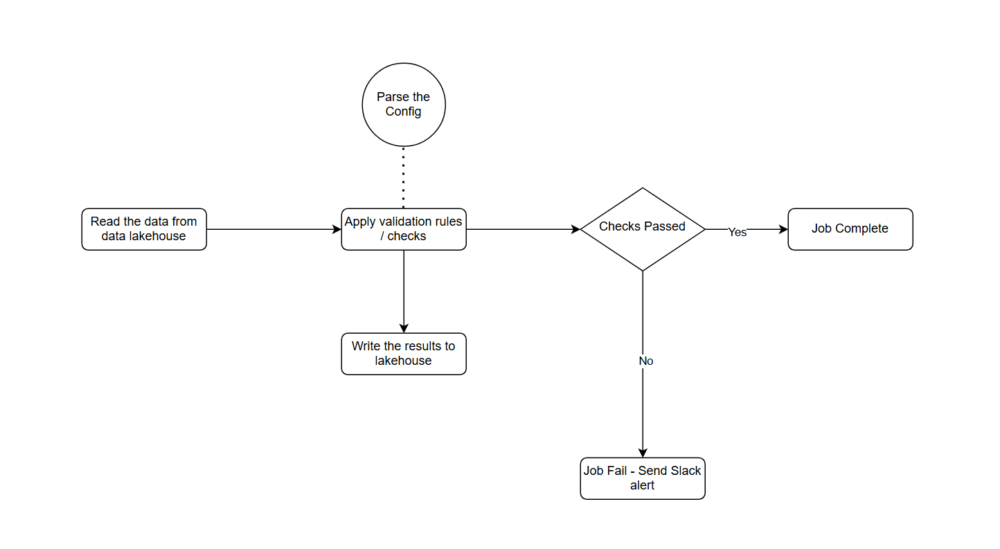

# Ilum Data Quality Framework
This project aims at providing a high level use case of a configuration-driven data quality framework for Ilum, utilizing Deequ for scalable validation on Apache Spark. It enables dynamic rule configuration using YAML/JSON config and integrates seamlessly with Ilum’s data lakehouse.

## Main idea behind this use case
- Ilum is a data lakehouse, and ensuring availability of high-quality data before ingestion for business specific pipelines prevents bad data from polluting the system and improves the overall integrity of the data for the downstream systems.
- A config-driven framework means teams across the organization can define data quality rules without modifying any code.

## Why is this a unique approach?
- Prevents bad data from being ingested.
- Config-driven, so a low-code approach enables business teams to define rules dynamically without modifying code.
- Scalable for multiple datasets
- Leverage Deequ for built-in checks (nulls, uniqueness, max, min) etc. and the capability to write your own Custom Checks (e.g., complex regex, business rules).
- Integrate Directly with Ilum (Spark-based processing).
- Provide Actionable Alerts on data quality issues and failures.

## Flow Chart of the overall process


## Steps involved in the overall process
- Step1: Config file
  - Define the source path of the data to be read
  - Define the Schema for the data
  - Define the rules and checks to run and the columns to run them on
## Example Configuration File (JSON Format)
This framework is driven by a JSON configuration file, allowing users to define data quality rules dynamically.

```json
{
  "source_path": "mention the source path here",
  "format": "parquet",
  "checks": [
    {
      "column": "customer_id",
      "rules": [
        { "type": "not_null" },
        { "type": "unique" }
      ]
    },
    {
      "column": "email",
      "rules": [
        { "type": "regex", "pattern": "^[A-Za-z0-9+_.-]+@[A-Za-z0-9.-]+$" }
      ]
    },
    {
      "column": "zip_code",
      "rules": [
        { "type": "length", "min": 5, "max": 5 }
      ]
    }
  ],
  "thresholds": {
    "max_null_percent": 5,
    "min_completeness": 0.95
  }
}
```


- Step2: Spark code
  - Create different classes to handle different functionalities such as config parser to parse the config, dataloader to load the data and store the results back to lakehouse, DQ class to run the checks and the main class to handle the       pass and failure cases
  - Parse the config and read the data from the source path
  - Create dataframe out of the source data
  - Run the checks defined in the config on the dataset
  - Write the resulting dataframe back to the datalake
  - Check the status of checks after processing, if any of the checks failed, do a hard exit from the code
    
- Step3: Orchestration, Alerting & Analysis
  - Schedule the data quality job using any orchestration tool such as Azkaban or Airflow
  - Based on the code status, the job will fail/succeed
  - Integrate slack alert/email alert mechanism to send alerts in case of job failure
  - Use any serverless query engine such as Athena or Presto to query and analyse the data quality checks result stored in the lakehouse

# Why this is awesome?
- Completly config driven - plug and play type of approach wherein the users only need to pass the config with the necessary info and the code written in the backend will do all the processing and parsing
- Highly Scalable with Spark
- Combines default checks with custom user-defined checks
- Maintains data intergrity and quality for the downstream systems consumption
