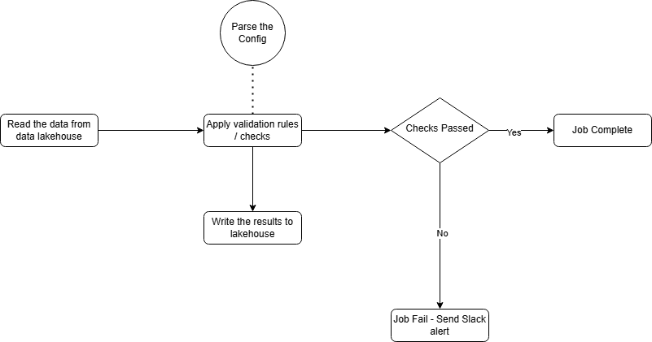

# Ilum Data Quality Framework
This project aims at providing a high level use case of a configuration-driven data quality framework for Ilum, utilizing Deequ for scalable validation on Apache Spark. It enables dynamic rule configuration using YAML/JSON config and integrates seamlessly with Ilum’s data lakehouse.

## Main idea behind this use case
- Ilum is a data lakehouse, and ensuring high-quality data before ingestion prevents bad data from polluting the system and improves the overall integrity of the data for the downstream systems.
- A config-driven framework means teams across the organization can define data quality rules without modifying any code.

## Why is this a unique approach?
-Prevents bad data from being ingested.
-Config-driven, so a low-code approach enables business teams to define rules dynamically without modifying code.
-Scalable for multiple datasets
-Leverage Deequ for built-in checks (nulls, uniqueness, max, min) etc. and the capability to write your own Custom Checks (e.g., complex regex, business rules).
-Integrate Directly with Ilum (Spark-based processing).
-Provide Actionable Alerts on data quality issues and failures.

## Flow Chart of the overall process

